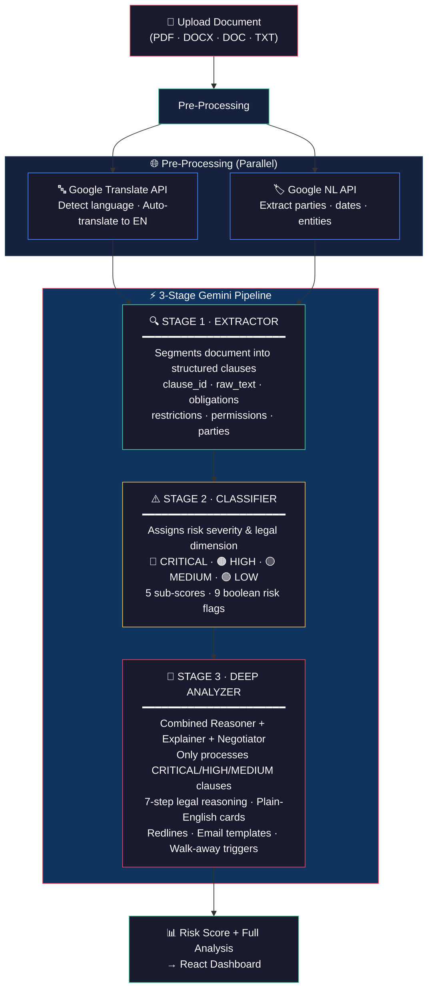
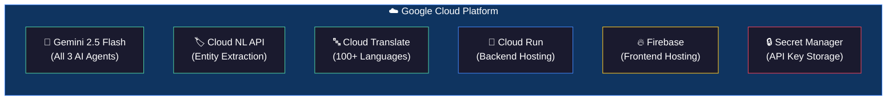
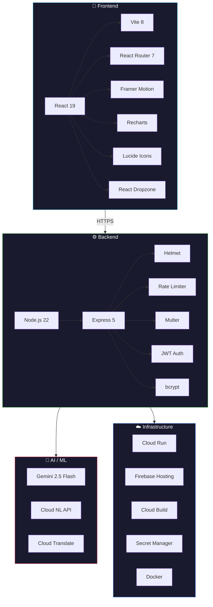
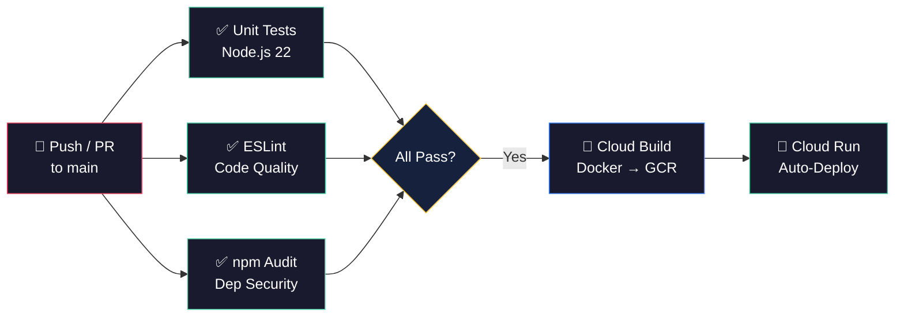

<div align="center">

<!-- HEADER -->


<br />

<p>
  <a href="https://lexguard-ai-204677140973.us-central1.run.app"></a>
  &nbsp;
  <a href="https://github.com/Ndheeraj906/LexGuard-AI/actions/workflows/test.yml"></a>
  &nbsp;
  <a href="./LICENSE"></a>
</p>

<p>
  
  
  
  
  
  
  
  
</p>

<br />

> **Legal documents are deliberately dense, asymmetric, and written to favor the drafting party.**
> Most people sign contracts without understanding what they agree to.
>
> *LexGuard changes that.*

<br />

<table>
<tr>
<td align="center" width="140"><strong>🤖</strong><br /><sub><strong>3</strong> AI Agents</sub></td>
<td align="center" width="140"><strong>📊</strong><br /><sub><strong>7</strong> Risk Dimensions</sub></td>
<td align="center" width="140"><strong>📋</strong><br /><sub><strong>40+</strong> Clause Types</sub></td>
<td align="center" width="140"><strong>📄</strong><br /><sub><strong>25+</strong> Doc Types</sub></td>
<td align="center" width="140"><strong>🌍</strong><br /><sub><strong>100+</strong> Languages</sub></td>
<td align="center" width="140"><strong>⚡</strong><br /><sub>< <strong>2 min</strong> Analysis</sub></td>
</tr>
</table>

</div>

<br />

---

<br />

## 🧠 The 3-Stage AI Pipeline

LexGuard's core intelligence is a **3-stage sequential pipeline** — each agent builds on the previous stage's output, progressively deepening the analysis:

<br />



<br />

<details>
<summary><strong>💡 Why 3 Stages Instead of 5?</strong></summary>

<br />

The pipeline was architecturally optimized from a 5-agent design to **3 highly efficient stages** — combining the Legal Reasoner, Plain-English Explainer, and Negotiation Advisor into a single deep analysis call (Stage 3). This design:

- **Reduces latency** — fewer sequential API calls
- **Minimizes token usage** — shared context eliminates redundant clause re-reading
- **Produces more coherent output** — reasoning, explanation, and negotiation strategy are cross-referenced in a single inference pass
- **Preserves depth** — the combined Stage 3 still performs the full 7-step legal reasoning framework

</details>

<br />

---

<br />

## ⚡ Key Features

<table>
<tr>
<td width="50%">

### 📄 Smart Document Parsing
- Drag-and-drop upload (PDF, DOCX, DOC, TXT)
- Up to 25MB per file
- Auto-detects 25+ document categories
- Extracts text from complex layouts

</td>
<td width="50%">

### 🌍 Multilingual Intelligence
- Auto-detects document language
- Translates 100+ languages to English
- Preserves original language metadata
- Flags translated clauses for transparency

</td>
</tr>
<tr>
<td width="50%">

### 🎯 Deep Risk Classification
- 5 severity levels (CRITICAL → INFORMATIONAL)
- 7 risk dimensions (Financial, Privacy, IP, etc.)
- 40+ clause categories
- 9 boolean risk flags per clause
- 5 sub-scores (scope, duration, asymmetry, ambiguity, deviation)

</td>
<td width="50%">

### 🧠 7-Step Legal Reasoning
- Intent analysis — *what's the legal purpose?*
- Scope detection — *geographic + temporal reach*
- Implication inference — *all practical consequences*
- Adversarial simulation — *worst-case exploitation*
- Contradiction scan — *conflicts between clauses*
- Undefined terms — *vague/exploitable language*
- Standard comparison — *how does this deviate?*

</td>
</tr>
<tr>
<td width="50%">

### 📝 Negotiation War Room
- **Strategy grid** — Reject / Redline / Clarify / Accept
- **Redline language** — drop-in replacement clause text
- **Email template** — ready-to-send negotiation email
- **Power dynamics** — leverage assessment
- **Walk-away triggers** — when not to sign

</td>
<td width="50%">

### 🛡️ Anti-Dilution Risk Scoring
```
score = max(severities) + 0.10 × Σ(rest)
```
One CRITICAL clause won't get buried by 20 boilerplate LOW clauses. The formula ensures dangerous clauses **always** surface at the top.

</td>
</tr>
</table>

<br />

---

<br />

## 🚀 Live Deployment

<div align="center">
<table>
<tr>
<th>Layer</th>
<th>URL</th>
<th>Platform</th>
<th>Status</th>
</tr>
<tr>
<td>🌐 <strong>Frontend</strong></td>
<td><a href="https://promptwars-community-x-ascen.web.app"><code>promptwars-community-x-ascen.web.app</code></a></td>
<td>Firebase Hosting</td>
<td>✅ Live</td>
</tr>
<tr>
<td>⚙️ <strong>Backend API</strong></td>
<td><a href="https://lexguard-backend-519047861069.us-central1.run.app"><code>lexguard-backend-*.us-central1.run.app</code></a></td>
<td>Google Cloud Run</td>
<td>✅ Live</td>
</tr>
</table>
</div>

<br />

---

<br />

## 🔧 Google Cloud Services



| Service | Module | Legal Use Case |
|:---|:---|:---|
| **Gemini 2.5 Flash** | `services/googleGemini.js` | Powers all 3 AI agents — clause extraction, risk classification, deep legal reasoning, plain-English explanation, negotiation strategy |
| **Cloud NL API** | `services/googleNaturalLanguage.js` | Extracts named entities — parties, organizations, dates, monetary values, jurisdictions |
| **Cloud Translate** | `services/googleTranslate.js` | Auto-detects language; translates non-English contracts to English before pipeline |
| **Cloud Run** | `infrastructure/cloudbuild.yaml` | Serverless backend deployment with auto-scaling (2 vCPU, 2GB RAM, max 10 instances) |
| **Firebase Hosting** | `firebase.json` | CDN-backed SPA hosting with SPA rewrites |
| **Secret Manager** | `cloudbuild.yaml` | Secure API key storage for production |

<br />

---

<br />

## 🏗️ Architecture

<br />

<details>
<summary><strong>📁 Full Project Structure</strong> (click to expand)</summary>

<br />

```
LexGuard-AI/
│
├── 🎨 frontend/                          React 19 + Vite 8 SPA
│   ├── src/
│   │   ├── pages/
│   │   │   ├── Login.jsx                 Auth: email + password + phone
│   │   │   ├── Signup.jsx                Registration with validation
│   │   │   ├── Dashboard.jsx             Upload zone · stats · session history
│   │   │   └── AnalysisPage.jsx          4-tab view: Overview│Clauses│Negotiate│Raw
│   │   ├── components/
│   │   │   ├── Navbar.jsx                Navigation bar with auth state
│   │   │   ├── DocumentUploader.jsx      Drag-and-drop with real-time progress
│   │   │   ├── ClauseCard.jsx            Expandable card: severity · reasoning · redlines
│   │   │   └── RiskComponents.jsx        Risk gauge · breakdown bars · clause counts
│   │   ├── context/
│   │   │   └── AuthContext.jsx           JWT auth provider (localStorage)
│   │   └── services/
│   │       └── api.js                    Axios/fetch API client
│   ├── Dockerfile                        nginx-alpine production build
│   └── package.json                      React 19 · Vite 8 · Framer Motion · Recharts
│
├── ⚙️ backend-node/                      Node.js 22 + Express 5 (Active)
│   ├── src/
│   │   ├── index.js                      Server: Helmet · CORS · rate limiting · routes
│   │   ├── agents.js                     🤖 3-stage Gemini AI pipeline
│   │   ├── pipeline.js                   Orchestrator · session manager · result assembly
│   │   ├── services/
│   │   │   ├── googleGemini.js           Gemini SDK wrapper + SHA-256 TTL cache
│   │   │   ├── googleNaturalLanguage.js  NL API: parties · orgs · dates · monetary
│   │   │   ├── googleTranslate.js        Language detection + translation
│   │   │   ├── KeyManager.js             Multi-key rotation + SMS quota alerts
│   │   │   ├── smsService.js             Twilio SMS for admin notifications
│   │   │   └── emailService.js           Nodemailer/Gmail welcome emails
│   │   ├── utils/
│   │   │   ├── riskScoring.js            Anti-dilution risk score formula
│   │   │   ├── documentParser.js         PDF (pdf-parse) · DOCX (mammoth) · TXT
│   │   │   └── db.js                     JSON file-based user store
│   │   └── tests/
│   │       ├── unit.test.js              Unit tests (node:test)
│   │       └── integration.test.js       Integration tests
│   ├── Dockerfile                        Node 22-alpine for Cloud Run
│   └── .env.example                      Environment variable template
│
├── 🐍 backend/                           Python/FastAPI (Legacy 5-agent version)
│
├── 🏗️ infrastructure/
│   ├── cloudbuild.yaml                   Cloud Build: Docker → GCR → Cloud Run
│   ├── firestore.rules                   Per-user document isolation
│   ├── firestore.indexes.json            Firestore indexes
│   └── storage.rules                     Per-user upload isolation
│
├── 🔄 .github/workflows/
│   └── test.yml                          CI: Unit Tests · ESLint · npm Audit
│
├── 🐳 Dockerfile                         Combined production build (frontend + backend)
├── firebase.json                         Firebase Hosting + Firestore config
└── README.md                             ← You are here
```

</details>

<br />

### Tech Stack Breakdown



<br />

---

<br />

## 🔌 API Reference

<details>
<summary><strong>📡 REST Endpoints</strong> (click to expand)</summary>

<br />

| Method | Endpoint | Description | Auth |
|:---|:---|:---|:---|
| `GET` | `/api/health` | Health check | ❌ |
| `POST` | `/api/auth/signup` | Create account (name, email, password, phone) | ❌ |
| `POST` | `/api/auth/login` | Login → JWT token (7-day expiry) | ❌ |
| `POST` | `/api/v1/documents/upload` | Upload document & start analysis | ✅ |
| `GET` | `/api/v1/analysis/:session_id/status` | Poll pipeline progress (agent 0→3) | ✅ |
| `GET` | `/api/v1/analysis/:session_id` | Get full results (202 if processing) | ✅ |
| `GET` | `/api/v1/sessions` | List all analysis sessions | ✅ |

**Rate Limits:**
- `POST /upload` — 10 requests/min per IP
- All other endpoints — 60 requests/min per IP

</details>

<br />

---

<br />

## ⚙️ Quick Start

<div align="center">

```
  ① Clone  →  ② Configure  →  ③ Install  →  ④ Run  →  ⑤ Analyze!
```

</div>

<br />

### 1️⃣ Clone

```bash
git clone https://github.com/Ndheeraj906/LexGuard-AI.git
cd LexGuard-AI
```

### 2️⃣ Configure

```bash
cd backend-node
cp .env.example .env
```

```env
# .env — Required
GEMINI_API_KEY=your_gemini_api_key_here
GCP_PROJECT_ID=your_gcp_project_id

# Optional — for multi-key rotation
GEMINI_API_KEYS=key1,key2,key3

# Optional — for SMS alerts
TWILIO_ACCOUNT_SID=your_sid
TWILIO_AUTH_TOKEN=your_token
TWILIO_FROM_NUMBER=+1234567890
```

### 3️⃣ Install & Start Backend

```bash
npm install
npm start
```
> ✅ Backend running at `http://localhost:8000`

### 4️⃣ Install & Start Frontend

```bash
cd ../frontend
npm install
npm run dev
```
> ✅ Frontend running at `http://localhost:5173`

### 5️⃣ Run Tests

```bash
cd ../backend-node
npm test          # Unit + Integration tests
npm run lint      # ESLint code quality
```

<br />

---

<br />

## 🐳 Production Deployment

<details>
<summary><strong>☁️ Google Cloud Run (Backend)</strong></summary>

<br />

```bash
cd backend-node

# Build & push Docker image
gcloud builds submit --tag gcr.io/YOUR_PROJECT/lexguard-backend

# Deploy to Cloud Run
gcloud run deploy lexguard-backend \
  --image gcr.io/YOUR_PROJECT/lexguard-backend \
  --platform managed \
  --region us-central1 \
  --allow-unauthenticated \
  --memory 2Gi \
  --cpu 2 \
  --max-instances 10 \
  --set-env-vars GCP_PROJECT_ID=YOUR_PROJECT \
  --set-secrets GEMINI_API_KEY=lexguard-gemini-key:latest
```

</details>

<details>
<summary><strong>🔥 Firebase Hosting (Frontend)</strong></summary>

<br />

```bash
cd frontend
npm run build
firebase deploy --only hosting
```

</details>

<details>
<summary><strong>🔄 Automated CI/CD via Cloud Build</strong></summary>

<br />

Every push triggers the `infrastructure/cloudbuild.yaml` pipeline:

```
Git Push → Docker Build → Push to GCR → Deploy to Cloud Run
```

The pipeline uses **Secret Manager** for API keys — no secrets in environment variables.

</details>

<br />

---

<br />

## 🔐 Security

<table>
<tr>
<td align="center">🔑</td>
<td><strong>API Key Protection</strong></td>
<td>Stored in <code>.env</code> (dev) / Secret Manager (prod) — never committed to git</td>
</tr>
<tr>
<td align="center">🚦</td>
<td><strong>Rate Limiting</strong></td>
<td>10 uploads/min · 60 API calls/min per IP via <code>express-rate-limit</code></td>
</tr>
<tr>
<td align="center">🪖</td>
<td><strong>Security Headers</strong></td>
<td>Helmet.js enforces CSP, HSTS, X-Frame-Options on all responses</td>
</tr>
<tr>
<td align="center">🔒</td>
<td><strong>Authentication</strong></td>
<td>bcrypt password hashing (salt rounds: 10) · JWT tokens (7-day expiry)</td>
</tr>
<tr>
<td align="center">🛡️</td>
<td><strong>Input Validation</strong></td>
<td>File type/size checks · null-byte stripping · UUID format validation</td>
</tr>
<tr>
<td align="center">🐳</td>
<td><strong>Container Security</strong></td>
<td>Non-root user in production Docker containers</td>
</tr>
<tr>
<td align="center">🔄</td>
<td><strong>Key Rotation</strong></td>
<td>Multi-key Gemini rotation with Twilio SMS alerts on quota exhaustion</td>
</tr>
</table>

<br />

---

<br />

## 🔄 CI/CD Pipeline



<br />

---

<br />

## ⚠️ Limitations

| | Limitation | Details |
|:---|:---|:---|
| ⚖️ | **Not legal advice** | LexGuard is an awareness tool. Always consult a licensed attorney for binding guidance. |
| 🌐 | **English-optimized** | Legal reasoning is tuned for English text. Google Translate handles other languages, but accuracy may vary for jurisdiction-specific terms. |
| 💾 | **In-memory sessions** | Sessions reset on server restart. Add Redis or Firestore for production persistence. |
| 📦 | **File size limit** | Maximum 25MB per upload. Contracts over 150 pages may be truncated at the extraction stage. |
| 🔑 | **API quotas** | Gemini free tier has rate limits. Multi-key rotation mitigates this — upgrade for heavy production use. |

<br />

---

<br />

## 📄 License

Distributed under the **MIT License** — see [`LICENSE`](./LICENSE) for details.

<br />

---

<br />

<div align="center">


<br />

**Built with ❤️ using Google Gemini AI**

<sub>⚠️ LexGuard is an AI-powered awareness tool and does not constitute legal advice.<br />Consult a licensed attorney in your jurisdiction for legally binding guidance.</sub>

<br /><br />

<a href="https://lexguard-ai-204677140973.us-central1.run.app/login"></a>
&nbsp;
<a href="https://github.com/Ndheeraj906/LexGuard-AI"></a>
&nbsp;
<a href="https://github.com/Ndheeraj906/LexGuard-AI/issues"></a>

<br /><br />

⭐ **Star this repo if LexGuard helped you understand your contracts better!** ⭐

</div>
